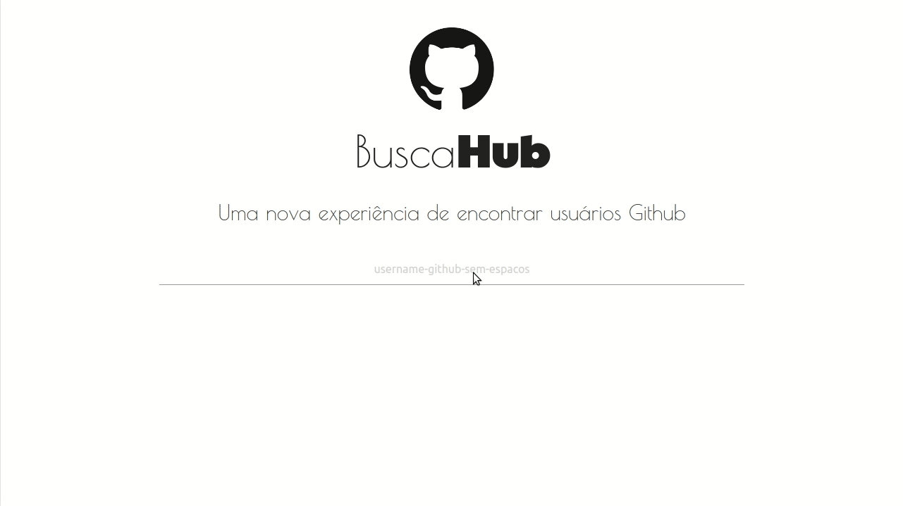

<h1 align = "center">
  
</h1>

# BUSCAHUB
Este projeto utiliza chamadas a API github para buscar usuários com base no termo digitado na caixa de pesquisa. Tudo isso feito utilizando a tecnica de autocomplete.

<h1 align = "center">
  
</h1>

# Tecnologias
- TypeScript
- Angular
- Jasmine
- Rxjs
- Materialize

# Screenshots

## Web/Lista
<h1 align = "center">
  
</h1>

## Web/Detalhes
<h1 align = "center">
  
</h1>

## App
<h1 align = "center">
 
  
</h1>

# Pontos interessantes
Este projeto foi criado em outubro de 2018, na ocasião eu já tinha conhecimento de angular mas trabalhava com a versão 1+, e utilizava a versão atual em pequenos projetos como forma de estudo. Praticamente 2 anos depois, eu resolvi aplicar os conhecimentos que obtive ao longo deste tempo como a criação de testes unitários, a melhor utilização da biblioteca rxjs e maior compreensão de estilização do html e responsividade.

## Testes unitários
Este projeto contém testes unitários, é importante resaltar que a versão do projeto é antiga e eu não quis atualizar porque o objetivo era refatorar apenas o código e implementar novos pontos de vista para o projeto, por isso alguns testes estão desatualizados de acordo com a versão atual do [jasmine](https://jasmine.github.io/).
 - Em breve vou escrever pequenos artigos explicando as ideias por trás dos testes aqui criados.

## RXJS
Excelente biblioteca utilizada nativamente pelo angular, que nos permite trabalhar de forma assincrona com muita facilidade. Este projeto utiliza os métodos implementados pelo [rxjs](https://www.learnrxjs.io/) mais utilizados e alguns não tanto assim.
- Em breve vou escrever um pequeno artigo explicando as ideias por trás da utilização de cada um.

## Materialize, Grid, Flex
Este projeto utiliza para estilização a biblioteca do [materialize](https://materializecss.com/). É possível notar alguns detalhes referentes ao esquema de grid, algumas estilizações próprias do materialize como por exemplo a utilizada no input e no card. Também utilizei  [flexbox](https://developer.mozilla.org/pt-BR/docs/Web/CSS/CSS_Flexible_Box_Layout/Conceitos_Basicos_do_Flexbox) para exibir a lista com os cards dos usuários na tela.

- Em breve vou escrever um pequeno artigo abordando este tema.
